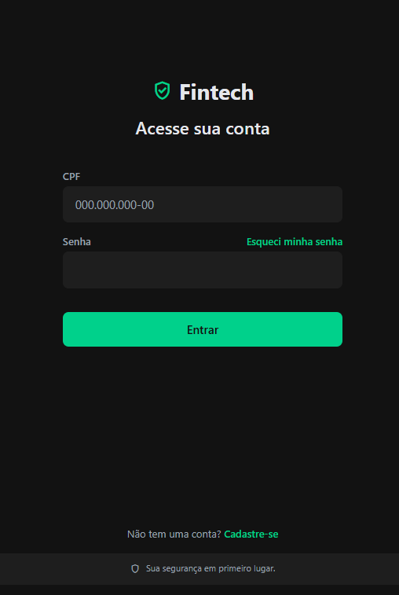

# 🏦 FintechBankApp



> **FintechBankApp** é uma aplicação bancária moderna e completa, desenvolvida como projeto didático para treinamento de desenvolvimento Web, APIs e **testes automatizados**. Este projeto oferece um ambiente rico e desafiador para QAs experientes praticarem e aprimorarem suas habilidades em automação de testes.

---

## 📋 Sobre o Projeto

FintechBankApp é um projeto didático desenvolvido para treinamento de desenvolvimento Web e APIs com foco em boas práticas aplicáveis ao ecossistema Java + frameworks (conceitos, padrões e arquitetura). A implementação de referência desta branch usa Node.js (Express) no backend e Vite + React + TypeScript no frontend para acelerar a prática e a validação dos fluxos.

O objetivo é proporcionar um ambiente completo para:
- Exercitar princípios SOLID, Clean Code e testes automatizados.
- Simular rotinas bancárias (faturas, cartão de crédito, PIX, extrato).
- Praticar integrações com diferentes bancos de dados e ambientes.

---

## 🎯 O que este Projeto Oferece para um QA Experiente?

Este projeto foi projetado especificamente para oferecer uma experiência completa e desafiadora para profissionais de QA que desejam praticar e aprimorar suas habilidades em automação de testes. Abaixo estão os principais pontos de interesse:

### 🔐 **1. Autenticação e Segurança - Superfície Rica para Testes**

A tela de login (mostrada na imagem acima) apresenta múltiplos pontos de teste, oferecendo uma superfície rica para aplicação de diversas técnicas de teste automatizado e manual:

#### **Cabeçalho e Branding**
- **Consistência Visual**: Testes de branding e identidade visual (logo, cores, tipografia)
- **Acessibilidade**: Validação de contraste de cores (fundo escuro com texto branco)
- **Internacionalização**: Testes de localização se houver suporte a múltiplos idiomas

#### **Campo CPF - Validações Complexas**
O campo CPF com máscara formatada (`000.000.000-00`) oferece oportunidades extensas de teste:

- **Validação de Máscara**:
  - Aplicação automática da máscara durante digitação
  - Aceitação apenas de dígitos numéricos
  - Formatação automática conforme o usuário digita
  - Comportamento com backspace e delete

- **Validação de Dados**:
  - CPFs válidos estruturalmente (algoritmo de validação)
  - CPFs inválidos (todos os dígitos iguais, sequências inválidas)
  - CPFs inexistentes (integração com serviços de validação)
  - Cenários de borda (menos de 11 dígitos, mais de 11 dígitos)

- **Caracteres e Segurança**:
  - Rejeição de letras e caracteres especiais
  - Testes de injeção (SQL, XSS, caracteres especiais)
  - Tratamento de espaços e formatação incorreta

- **Feedback Visual e UX**:
  - Mensagens de erro claras e informativas
  - Estados visuais (foco, erro, sucesso)
  - Validação em tempo real vs. validação no submit

#### **Campo Senha - Segurança e Usabilidade**
O campo de senha oferece testes críticos de segurança:

- **Força da Senha**:
  - Comprimento mínimo e máximo
  - Requisitos de complexidade (maiúsculas, minúsculas, números, símbolos)
  - Validação de senhas fracas vs. fortes

- **Autenticação**:
  - Login com credenciais válidas
  - Login com senha incorreta para CPF válido
  - Login com CPF inexistente
  - Campos vazios e validação de obrigatoriedade

- **Segurança Avançada**:
  - Tentativas de força bruta (limite de tentativas, bloqueio de conta)
  - Testes de injeção de dados
  - Funcionalidade de mostrar/ocultar senha (se implementada)
  - Proteção contra ataques de timing

- **Fluxo de Recuperação de Senha**:
  - Link "Esqueci minha senha" inicia fluxo crítico
  - Testes de usabilidade do fluxo completo
  - Validação de segurança (tokens de redefinição, tempo de expiração)
  - Integração com serviços de e-mail/SMS
  - Validação de tokens e códigos de verificação

#### **Botão de Ação Principal - "Entrar"**
O botão verde "Entrar" oferece múltiplos cenários de teste:

- **Estados do Botão**:
  - Habilitado/desabilitado conforme preenchimento dos campos
  - Estados visuais (hover, active, focus)
  - Estado de loading durante autenticação

- **Funcionalidade**:
  - Comportamento com campos vazios
  - Comportamento com dados válidos
  - Comportamento com dados inválidos
  - Tratamento de erros de rede/conectividade

- **Respostas da Aplicação**:
  - Redirecionamento correto após login bem-sucedido
  - Mensagens de erro claras e informativas em caso de falha
  - Tratamento de múltiplas tentativas de login

#### **Links Secundários**
- **"Cadastre-se"**: 
  - Fluxo completo de onboarding para novos usuários
  - Validação extensiva de dados de cadastro
  - Criação de conta e integração com sistema
  - Mensagens de sucesso/erro
  - Validação de CPF já cadastrado

#### **Mensagem de Segurança no Rodapé**
- **Consistência**: Verificar se mensagem aparece em outras telas sensíveis
- **Acessibilidade**: Legibilidade e propósito claro do ícone
- **Conformidade**: Alinhamento com padrões de segurança financeira

#### **Considerações Gerais de Teste**
- **Responsividade**: Testes em diferentes tamanhos de tela e dispositivos (web e mobile)
- **Performance**: Tempo de carregamento da tela e tempo de resposta ao tentar logar
- **Acessibilidade**: Testes para usuários com deficiência (leitores de tela, navegação por teclado, contraste)
- **Localização**: Verificação de todos os textos se o projeto suportar múltiplos idiomas

### 🧪 **2. Estrutura de Testes Automatizados Completa**

O projeto já possui uma base sólida de testes automatizados implementados:

#### **Testes de API (Backend)**
- **Jest + Supertest**: Testes unitários e de integração para endpoints da API
- **Newman (Postman)**: Testes de API via coleções Postman com relatórios HTML/JSON
- **Cobertura de Testes**: Scripts configurados para análise de cobertura
- **Testes Especializados**:
  - Ciclo de vida completo de faturas (`invoice-lifecycle.test.js`)
  - Fluxo de pagamento completo (`invoice-payment-complete-flow.test.js`)
  - Testes de cadastro e autenticação (`signup.test.js`)

#### **Testes de Frontend (Web)**
- **Vitest**: Framework de testes para componentes React
- **Testes de Renderização**: Validação de componentes e páginas
- **Testes de Integração**: Validação de fluxos completos

#### **Testes Mobile**
- **React Native**: Aplicação mobile completa para testes
- **Build de APK**: Scripts automatizados para geração de builds de teste
- **Testes de Conectividade**: Validação de integração com API

### 📊 **3. Cenários de Teste Complexos e Realistas**

#### **Fluxos Bancários Completos**
- **Gestão de Faturas**: Testes do ciclo de vida completo (abertura, vencimento, pagamento, fechamento)
- **Operações PIX**: Transferências, chaves PIX, confirmações e comprovantes
- **Cartão de Crédito**: Faturas, parcelamento, antecipação de parcelas
- **Extrato e Transações**: Histórico, filtros, paginação
- **Marketplace Integrado**: Compras, carrinho, checkout, comprovantes

#### **Funcionalidades Administrativas**
- **Painel Admin**: Gerenciamento de clientes, aprovações, solicitações
- **Recuperação de Senha com Aprovação**: Fluxo completo com intervenção administrativa
- **Gestão de Dados**: CRUD completo de usuários, produtos, transações

### 🛠️ **4. Ferramentas e Tecnologias Modernas**

- **Backend**: Node.js, Express, JWT, bcrypt, Swagger
- **Frontend**: React, TypeScript, Vite, Tailwind CSS
- **Mobile**: React Native, Capacitor
- **Banco de Dados**: Suporte para PostgreSQL, SQLite, Databricks
- **Testes**: Jest, Vitest, Newman, Supertest
- **Documentação**: Swagger/OpenAPI, Markdown

### 🎓 **5. Oportunidades de Aprendizado e Prática**

#### **Para QAs que Desejam Implementar Testes E2E**
- Estrutura pronta para implementação de testes com Selenium WebDriver
- Padrão Page Object Model (POM) pode ser aplicado
- Cenários BDD/Cucumber podem ser implementados
- Fluxos complexos já mapeados e documentados

#### **Para QAs que Desejam Aprimorar Testes de API**
- API REST completa com documentação Swagger
- Coleções Postman prontas para execução
- Scripts de geração de massa de dados de teste
- Testes de integração complexos já implementados

#### **Para QAs que Desejam Testar Aplicações Mobile**
- Aplicação React Native completa
- Scripts de build automatizados
- Testes de conectividade e integração
- Ambiente configurado para testes em dispositivos reais

### 📈 **6. Métricas e Relatórios**

- **Relatórios Newman**: HTML e JSON para análise detalhada
- **Cobertura de Código**: Configuração pronta para análise de cobertura
- **Logs Estruturados**: Sistema de logging para rastreabilidade
- **Documentação Completa**: READMEs específicos para cada módulo

### 🔄 **7. Ambientes e Configurações**

- **Múltiplos Ambientes**: Desenvolvimento, teste, produção
- **Docker**: Containerização para ambiente isolado
- **Variáveis de Ambiente**: Configuração flexível via `.env`
- **Scripts Automatizados**: Setup e execução simplificados

### 🎯 **8. Análise Detalhada da Tela de Login para QA**

A tela de login do FintechBankApp (mostrada na imagem) foi projetada especificamente para oferecer uma **superfície rica de ataque** para testes automatizados e manuais. Cada elemento da interface apresenta oportunidades específicas de teste:

#### **Elementos Visuais e Oportunidades de Teste**

1. **Cabeçalho da Aplicação**:
   - Ícone de escudo verde com checkmark branco + texto "Fintech"
   - Título "Acesse sua conta" centralizado
   - **Testes**: Consistência de branding, acessibilidade (contraste), internacionalização

2. **Campos de Entrada**:
   - **CPF**: Placeholder formatado `000.000.000-00` com máscara automática
   - **Senha**: Campo mascarado com link "Esqueci minha senha" em verde
   - **Testes**: Validação de formato, segurança, usabilidade, integração

3. **Botão Principal**:
   - Botão verde vibrante "Entrar" centralizado
   - **Testes**: Estados (habilitado/desabilitado), feedback visual, redirecionamento

4. **Links Secundários**:
   - "Não tem uma conta? Cadastre-se" na parte inferior
   - **Testes**: Fluxo de cadastro, validação de dados, onboarding

5. **Mensagem de Segurança**:
   - Ícone de escudo com cadeado + "Sua segurança em primeiro lugar."
   - **Testes**: Consistência, acessibilidade, conformidade

#### **Abordagem de Teste Recomendada**

Esta tela oferece uma **rica superfície para a aplicação de diversas técnicas de teste**, abrangendo:

- ✅ **Testes Funcionais**: Validação de fluxos de login, cadastro, recuperação
- ✅ **Testes de Segurança**: Injeção de dados, força bruta, validação de credenciais
- ✅ **Testes de Usabilidade**: Feedback visual, mensagens de erro, navegação
- ✅ **Testes de Acessibilidade**: Leitores de tela, navegação por teclado, contraste
- ✅ **Testes de Performance**: Tempo de carregamento, tempo de resposta
- ✅ **Testes de Responsividade**: Diferentes tamanhos de tela e dispositivos
- ✅ **Testes de Integração**: E-mail/SMS, serviços externos, banco de dados

---

## 🚀 Principais Módulos

- **`API/`**: Backend Express, documentação Swagger, scripts de migração/seed e **testes automatizados completos**
- **`WEB/`**: Frontend React + Vite com páginas e componentes de fluxo bancário e **testes com Vitest**
- **`MOBILE/`**: Aplicação React Native completa para testes mobile
- **`docker-compose.yml`**: Infraestrutura de Postgres via Docker (quando aplicável)

---

## 📦 Branches de Banco de Dados

Este projeto possui três tipos de branches para treinar com diferentes bancos de dados:
- **Databricks**: Integração via SQL Warehouse/HTTP Path (produção/labs)
- **SQLite**: Armazenamento local simples para desenvolvimento rápido
- **Postgres (Docker)**: Banco relacional rodando em container para ambiente local

Cada branch ajusta a configuração de conexão e os scripts conforme o destino (consulte o README/arquivos de cada branch para detalhes específicos).

---

## ⚙️ Pré-requisitos

- Node.js (>= 18)
- Docker Desktop (para a opção Postgres)
- Opcional (Databricks): Credenciais e acesso a um SQL Warehouse
- **Para Testes**: Newman (para testes de API), Jest, Vitest

---

## 🔧 Variáveis de Ambiente (API)

Copie `API/.env.example` para `.env` e ajuste conforme o ambiente. Exemplos suportados:
- Servidor: `PORT`, `JWT_SECRET`
- Databricks: `DATABRICKS_SERVER_HOSTNAME`, `DATABRICKS_HTTP_PATH`, `DATABRICKS_TOKEN`, `DATABRICKS_CATALOG`, `DATABRICKS_SCHEMA`
- Postgres: `DB_*` ou `PG_*` (host, porta, usuário, senha, database, schema)

Por padrão, `PORT=3001`. A API ficará disponível em `http://localhost:3001`.

---

## 🏃 Como Executar (Desenvolvimento)

### 1) Backend (API)
```bash
cd API
npm install
npm run dev:api
```

### 2) Frontend (WEB)
```bash
cd WEB
npm install
npm run dev
```

- A interface web abrirá em `http://localhost:5173` (padrão do Vite)
- O frontend consome a API em `http://localhost:3001` (ajustável via `.env`/config)

---

## 📱 Expondo API para Mobile (ngrok)

Para permitir que o aplicativo mobile acesse a API localmente:

1. Certifique-se de que a API está rodando (`npm run dev:api`)
2. Em um novo terminal, execute:
```bash
ngrok http 3001
```
3. Copie a URL HTTPS gerada (ex: `https://xxxx.ngrok-free.app`)
4. Atualize a URL da API no projeto Mobile (em `MOBILE/src/services/api.ts` ou `.env`)

---

## 🐳 Postgres via Docker (opção de branch Postgres)

Suba o container antes de executar migração/seed:
```bash
docker-compose up -d
```

Execute migração e seed (no diretório `API/`):
```bash
npm run db:migrate
npm run db:seed
```

---

## 🏗️ Build e Preview (Frontend)

Para gerar build de produção do frontend:
```bash
cd WEB
npm run build
npm run preview
```

---

## 🧪 Testes

### Frontend (Vitest)
```bash
cd WEB
npm run test
```

### Backend (Jest + Newman)

#### Testes Unitários e de Integração (Jest)
```bash
cd API
npm run test                    # Todos os testes
npm run test:watch              # Modo watch
npm run test:coverage           # Com cobertura
npm run test:invoice-lifecycle  # Teste específico de ciclo de vida
npm run test:invoice-payment   # Teste de pagamento
```

#### Testes de API (Newman/Postman)
```bash
cd API
npm run test:newman:invoice     # Testes de ciclo de vida via Newman
```

Ou execute diretamente:
```bash
newman run postman-collection.json --reporters cli,html,json
```

**Documentação Completa**: Veja `API/NEWMAN-TESTS.md` para detalhes sobre execução de testes Newman.

### Geração de Massa de Dados para Testes
```bash
cd API
npm run generate:test-invoices  # Gera usuários e faturas de teste
```

---

## 📚 Endpoints de Referência (exemplos)

### Fatura e Cartão de Crédito
- `POST /cards/invoice/pay` — Pagamento da fatura
- `POST /cards/invoice/parcel` — Parcelamento da fatura
- `POST /cards/installments/anticipate` — Antecipação de parcelas

### PIX
- `POST /pix/transfer` — Transferência PIX
- `POST /pix/transfer-credit` — PIX no crédito (com parcelamento)

Consulte o Swagger (`API/swagger.yaml`) ou a versão limpa (`API/swagger-clean.yaml`) para a lista completa.

---

## 📝 Observações

- Este repositório é usado como base prática para treinar conceitos de **Web e API com Java + frameworks**. A escolha por Node.js/React aqui facilita a rápida prototipação dos fluxos e testes automatizados; os mesmos princípios se aplicam ao ecossistema Java (ex.: Spring, JPA, etc.) em branches dedicadas.
- Ajuste as variáveis de ambiente conforme o banco alvo (Databricks/SQLite/Postgres).
- Para dúvidas sobre scripts e integrações, verifique os arquivos `API/package.json`, `WEB/package.json` e documentação em `API/README-backend.md` e `WEB/README.md`.

---

## 🎯 Comandos Básicos

```bash
npm run build              # Build do projeto
npx cap sync android       # Sincronizar com Capacitor (Mobile)
ngrok http 3001           # Expor API localmente
```

### Configuração de IP Fixo (Windows)

Execute no PowerShell como Administrador. **Cuidado**: Isso pode desconectar sua internet momentaneamente.

```powershell
New-NetIPAddress -InterfaceAlias "Wi-Fi" -IPAddress "192.168.0.105" -PrefixLength 24 -DefaultGateway "192.168.0.1"; Set-DnsClientServerAddress -InterfaceAlias "Wi-Fi" -ServerAddresses "8.8.8.8","8.8.4.4"
```

Se der erro dizendo que o IP já existe, use:
```powershell
Set-NetIPAddress -InterfaceAlias "Wi-Fi" -IPAddress "192.168.0.105" -PrefixLength 24; Set-DnsClientServerAddress -InterfaceAlias "Wi-Fi" -ServerAddresses "8.8.8.8","8.8.4.4"
```

**Arquivos que usam este IP:**
- `MOBILE/src/services/api.ts` (Linha 7)
- `MOBILE/src/pages/Login/index.tsx` (Linha 37)

---

## 📖 Documentação Adicional

- **API**: `API/README-backend.md`, `API/NEWMAN-TESTS.md`
- **WEB**: `WEB/README.md`
- **MOBILE**: `MOBILE/README.md`
- **Testes**: `API/tests/README-INVOICE-LIFECYCLE.md`, `API/tests/README-TESTE-PAGAMENTO-COMPLETO.md`
- **Guias**: `GUIA-TESTE-MOBILE-FATURAS.md`

---

**Desenvolvido com ❤️ para a comunidade de QA e Desenvolvimento**
